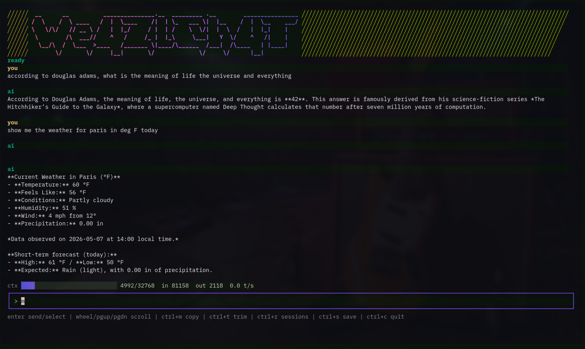

# WeazlChat



WeazlChat is a private, local-first AI chat TUI for vLLM and Ollama servers. Think of it as the straightforward, distraction-free terminal interface we all would have loved to have on our old Packard Bells and Mac Classics, wired up to modern local AI workflows. No fluff, no web wrappers, just your models and your prompt.

## Defaults

On first launch, WeazlChat drops a fresh `config.json` into `~/.config/weazlchat/` with sensible local defaults:

- `local-vllm`: `http://localhost:8000`
- model: `local-model`
- `local-ollama`: `http://localhost:11434`

Because hardcoding endpoints into a client is a terrible idea, WeazlChat reads the endpoint and model from the config at runtime.

## Run

```sh
go run ./cmd/weazlchat
```

## Install

```sh
./scripts/install.sh
```

The installer takes care of the heavy lifting. It builds `weazlchat`, tucks it into `~/.weazlchat/bin`, and adds that directory to your shell `PATH` if it is not already present.

During setup, you will be prompted for your provider type and URL. The script queries the provider for available models, optionally takes your tool API keys, writes `~/.config/weazlchat/config.json`, and boots straight into the TUI.

Provider URL rules: base URLs only, please.

- vLLM: `https://host:port` or `https://host`, without `/v1`
- Ollama: `http://host:11434`, without `/api`

If you accidentally paste the `/v1` or `/api` suffixes, the installer quietly fixes them for you. Tool API keys are optional: leave a prompt blank to keep an existing key, or type `-` to clear it.

The installer also asks for a context window preset:

- `small`: `8192` tokens
- `medium`: `16384` tokens
- `large`: `32768` tokens
- `xl`: `128000` tokens; heads up, this may cause out-of-memory errors on smaller local servers

Finally, the first run asks you to set a local history password. Session history and workspace saves are stored in SQLite with a password-protected vault and AES-GCM encrypted payloads.

Markdown rendering is enabled by default with Charmbracelet Glamour, so model output keeps its terminal-native shape: headings, lists, code blocks, links, quotes, and tables all get a little polish without turning the app into a browser.

## Build From Source

WeazlChat is a Go app, but it uses SQLite through `go-sqlite3`, so builds need Go 1.25 or newer, CGO, and a working C compiler. That is the one little bit of yak hair.

### macOS

Install Go and the Xcode command line tools:

```sh
xcode-select --install
```

Then build:

```sh
go build -o weazlchat ./cmd/weazlchat
go build -o weazlchat-setup ./cmd/weazlchat-setup
```

The install script also works on macOS-style shells:

```sh
./scripts/install.sh
```

### Windows

Install Go for Windows, then install a C compiler that Go can use with CGO. MSYS2 works well:

1. Install MSYS2 from https://www.msys2.org/
2. Open the MSYS2 UCRT64 shell.
3. Install the compiler:

```sh
pacman -S --needed mingw-w64-ucrt-x86_64-gcc
```

Make sure the UCRT64 `bin` directory is on your `PATH`, then build from PowerShell or the MSYS2 shell:

```sh
go build -o weazlchat.exe ./cmd/weazlchat
go build -o weazlchat-setup.exe ./cmd/weazlchat-setup
```

Run setup first if you want the guided config flow:

```sh
.\weazlchat-setup.exe
.\weazlchat.exe
```

## Keys

- `enter`: send message / select session
- `up` / `down`: recall previous prompts in the current session
- mouse wheel: scroll chat history
- `pgup` / `pgdown`: scroll chat history
- `home` / `end`: jump to top or bottom of chat history
- `ctrl+m`: toggle between copy mode and mouse scroll mode
- `ctrl+n`: start a new session
- `ctrl+r`: resume from session history
- `ctrl+d`: delete selected session from history
- `ctrl+s`: save current workspace view
- `ctrl+w`: list workspace saves
- `ctrl+t`: trim context into a summary checkpoint
- `esc`: back to chat
- `ctrl+c`: quit

## Telemetry And Context Trimming

The status line at the bottom of the viewport gives you the vitals on your local inference. Alongside a Bubble Charm progress bar showing estimated context usage, you get token counts (`in` and `out`) and current generation speed in tokens per second (`t/s`).

The provider's `context_window` lives in `~/.config/weazlchat/config.json`; it defaults to `32768` tokens, or whatever preset you chose during install.

Running out of room? Press `ctrl+t` to have the active model summarize the current conversation into a compact checkpoint. The summary target scales with your configured context window, bounded between 500 and 2000 tokens. Future requests send that checkpoint summary plus only the new messages, saving your hardware from replaying the entire session from the top.

If you forget, WeazlChat has your back. It automatically trims context when the estimate hits 97% of your window. Your current prompt stays outside the checkpoint and is sent normally right after the trim finishes.

## TUI Feedback

While you wait for inference, WeazlChat uses Bubble spinner animations with rotating status phrases such as `hacking_the_gibson`, `jacking_into_the_matrix`, `wheezing_the_juice`, and `chilling_the_tokens`. The phrases favor active `-ing` wording, stay stable for short responses, and swap just a couple of times during longer generations to keep the screen quiet.

Tool calls stay neatly tucked away in the transcript as `🔧 using tools`. When WeazlChat is summarizing older history into a checkpoint, it uses a distinct compaction animation so you know it is trimming context rather than hanging on a standard response.

Assistant responses are rendered with Glamour-powered Markdown once they land in the transcript, including when you resume a session or replay a saved workspace. Streaming text stays simple while it is still arriving, then gets cleaned up after the response is saved.

You can tune or disable Markdown rendering in `~/.config/weazlchat/config.json`:

```json
{
  "ui": {
    "resume_last_session": true,
    "render_markdown": true,
    "markdown_style": "dark"
  }
}
```

`markdown_style` accepts Glamour standard style names. WeazlChat defaults to `dark`; `auto` is treated as `dark` to avoid terminal color-query responses leaking into the input box in some terminals.

## Scrolling And Copy/Paste

Mouse wheel scrolling is enabled by default to make reviewing long conversations easy. Because the TUI has to capture the mouse to do this, standard terminal text selection can be intercepted.

You have two ways to grab text:

1. Toggle mode with `ctrl+m`: hit `ctrl+m` to enter copy mode. This releases mouse capture so your terminal can highlight and copy normally. Hit it again to go back to scrolling. The help line updates dynamically to show `ctrl+m copy` or `ctrl+m mouse`.
2. Use `shift` + drag: depending on your terminal emulator, holding `shift` while dragging often bypasses TUI mouse capture entirely, letting you highlight text without switching modes.

Large pasted blocks are stored as the full prompt payload under the hood, but displayed compactly in the input bar as `[PASTED n lines]` to keep your view tidy.

## Tool Support

WeazlChat is not just a static chat window. It supports function calling tools that let the AI model interact with external services and your local workspace. Tools execute automatically when allowed by their safety level.

Important: tools only work with models that understand function/tool calling. If your model does not support tool calls, normal chat still works, but WeazlChat cannot reliably ask it to run web search, weather, file, shell, SQLite, memory, or other tools. Use a tool-capable local model for the fun stuff.

### Enabling Tools

The installer can write this section for you, but to edit it manually, update `~/.config/weazlchat/config.json`:

```json
{
  "tools": {
    "enabled": true,
    "auto_execute_safe": true,
    "alpha_vantage_api_key": "YOUR_ALPHA_VANTAGE_API_KEY_HERE",
    "brave_api_key": "YOUR_BRAVE_API_KEY_HERE",
    "workspace_roots": ["/home/user/Code", "/home/user/Notes"],
    "max_output_chars": 12000,
    "max_file_bytes": 1048576
  }
}
```

Configuration options:

- `enabled`: flip to `true` to turn on tool support; default is `false`
- `auto_execute_safe`: automatically run safe tools without asking for confirmation; default is `true`
- `alpha_vantage_api_key`: API key for stock price lookups; optional
- `brave_api_key`: API key for Brave web search lookups; optional
- `workspace_roots`: restricted directories that file, shell, and SQLite tools are permitted to read from
- `max_output_chars`: maximum characters returned by tools before they are truncated
- `max_file_bytes`: maximum file size for local search/read tools

### Available Tools

#### General Utilities

- Calculator: standard math: add, subtract, multiply, divide, power, sqrt, percentage. Always available when tools are enabled.
- Current time: local machine date/time or specific IANA timezones. Always available when tools are enabled.
- Weather: current weather and short forecasts with Open-Meteo. Always available when tools are enabled, no API key required.
- Stock price: current stock prices and market data. Requires Alpha Vantage API key.
- Web search: Brave Search queries returning titles, URLs, snippets, and dates. Requires Brave API key.
- Fetch URL: grabs HTTP/HTTPS URLs and returns readable text. Private and local network addresses are rejected.

#### Local Workspace

Workspace tools only operate under configured `workspace_roots`.

- Local files: `list_files`, `search_files`, `read_file`, `create_file`.
- Read-only command: runs a tight allowlist of read-only commands such as `pwd`, `ls`, `find`, `rg`, `cat`, `git status`, `git diff`, `git log`, `git show`, `go test`, and `npm test`. Commands are passed safely as args, never as raw shell strings.
- SQLite query: executes read-only queries against local database files. Allowed SQL starts with `SELECT`, `WITH`, `EXPLAIN`, or `PRAGMA table_info`.
- Local memory: encrypted local memory storage with `remember`, `recall`, `list_memories`, and `forget`.

`create_file` only creates new text files under `workspace_roots`; it flat out refuses to overwrite existing files.

### How It Works

1. You ask a question that requires a tool, and the AI model automatically calls the right function.
2. Tool payloads stay hidden from the main chat transcript.
3. The result is fed back to the model to synthesize a natural language response.
4. Calls, results, history, and memories are stored in your local SQLite vault.

### Model Requirements

- vLLM: the loaded model must support function calling, such as models fine-tuned for tool use.
- Ollama: you need a model with native tool support. Good starting points include `llama3.1`, `mistral-nemo`, and `qwen2.5`.

## SSH App

The `wish-ssh-app` branch includes an experimental SSH server binary:

```sh
go build -o weazlchat-ssh ./cmd/weazlchat-ssh
```

`weazlchat-ssh` runs WeazlChat as a Wish-powered SSH app. It is not OpenSSH and it does not provide shell access. Clients connect directly into the TUI:

```sh
ssh -p 23234 user@server
```

SSH mode uses the server's `~/.config/weazlchat/config.json` for provider settings, tool settings, and API keys. Each authorized SSH public key gets its own encrypted SQLite database under `ssh.user_data_dir`, so users do not share chat history, memories, workspace saves, or vault passwords.

Add allowed client public keys to:

```sh
~/.config/weazlchat/authorized_keys
```

SSH config lives in `config.json`:

```json
{
  "ssh": {
    "listen": "0.0.0.0:23234",
    "host_key_path": "/home/user/.config/weazlchat/ssh_host_ed25519",
    "authorized_keys_path": "/home/user/.config/weazlchat/authorized_keys",
    "user_data_dir": "/home/user/.local/share/weazlchat/ssh-users"
  }
}
```

Heads up: tools run on the server machine and use the shared server-side config. That means file, shell, SQLite, web search, weather, stock, and memory tools operate from the server's point of view.

### Security

We take local privacy seriously, but this is still a small local app, not a hardware security module. Your vault is only as good as the password you choose. The bcrypt password check and encrypted payloads are there to keep casual prying eyes out; they are not a promise that a weak password will survive a determined offline attack against your database.

- Safe tools are strictly read-only, create-only for text files, or explicit local memory operations.
- File, shell, and SQLite tools are boxed into configured `workspace_roots`.
- `create_file` will never overwrite existing files.
- Shell commands are allowlisted and do not execute through an actual shell.
- URL fetching actively blocks private and local network IP addresses.
- Tool output is truncated before returning to the model to prevent massive context floods.
- Tool execution happens locally inside the WeazlChat process.
- API keys live in your local config file and are never shared by WeazlChat.
- Chat history, tool interactions, and memories are encrypted in your local database.

### Example Config

Check out `config.example.json` for a complete configuration template with tools enabled.

## License And Branding

WeazlChat is released under the MIT License. Use it, fork it, ship it, learn from it.

The `WeazlChat` name, screenshot, and project branding are part of this project identity. If you publish a substantially modified fork, please use a different name and visual branding so users can tell the projects apart.
